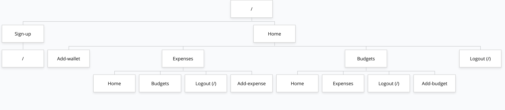

# Money Tracker 

## Overview

Having to track your expenses on a regular basis is indeed a very boring task. However, the mundanity associated with it cannot overpower its siignificance.

Money Tracker is a web app that helps you stay involved with your finances. It lets you create different budgets, log expenses in different categories, get a monthly spending report, amongst other useful features.

Be aware of where your money goes, identify and eliminate wasteful spending habits, and get in control of your expenses with Money Tracker!


## Data Model

The application will store Users, Budgets, Expenses, Wallets, and Categories

* users can have multiple wallets, budgets, and categories (via references).
* users can track their expenses in different categories and compare them with the set budget (via embedding and references).

An Example User:

```javascript
{
  username: "moneylover",
  hash: // a password hash,
  currency: "$",
  budget: 1, // reference to a budget object
  expenses: 25, // reference to an expense object
  wallets: 10 // reference to a wallet object
}
```

An Example Budget:

```javascript
{
  _id: 1,
  budgets: [{ budgetName: "Thanksgiving Trip", 
  setCategories: { transport: "100", food: "200", accommodation: "300"} 
  }]
}
```
An Example List of Expenses:

```javascript
{
  _id: 25,
  recent: { transport: 20, food: 10 }
  dailyExpenses: [
    { date: , spent: {}}
  ]
  budgetExpenses: [
    { budgetName: "Default", spent: { transport: "200", food: "500", accommodation: "150", education: "100", groceries: "50" } }, // default to track overall expenses 
    { budgetName: "Thanksgiving Trip", spent: { transport: "50", food: "30", accommodation: "90"} }
  ]  
}

```
An Example Wallet:

```javascript
{
  id: 10,
  wallets: { cash: "600", chaseCard: "700", citiBank: "200" }
}
```

## [Link to Commented First Draft Schema](db.mjs) 


## Wireframes

/ - web app home page / public page


/login - login page for existing users


/signup - sign up page for new users


/home - home page that opens as soon as a user logs in


/budget - budgets page to create a budget and track expenses for that budget


/expenses - expenses page to check expenses for a day and see the visualization


## Site map



## User Stories or Use Cases

1. as non-registered user, I can register a new account with the site
2. as a user, I can log in to the site
3. as a user, I can create a budget
4. as a user, I can log an expense
5. as a user, I can see a daily spending report
6. as a user, I can create a custom category to track my expenses
7. as a user, I can add a wallet
8. as a user, I can see my recent expenses

## Research Topics

* (5 points) Integrate user authentication
    * I have two options in mind currently, will choose one based on the difficulty level
    * Option 1: Google OAuth
    * Option 2: Sending verification email
* (4 points) vue.js
    * I will use vue.js as the frontend framework; it's a challenging library to learn, so I've assigned it 4 points

9 points total out of 8 required points


## [Link to Initial Main Project File](app.mjs) 

## Annotations / References Used

(__TODO__: list any tutorials/references/etc. that you've based your code off of)

1. [tutorial on vue.js](https://vuejs.org/v2/guide/)

