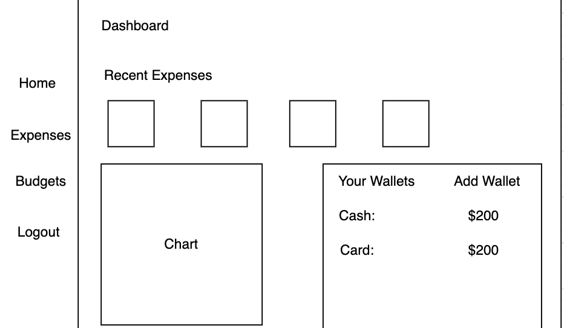

# Money Tracker 

## Overview

Having to track your expenses on a regular basis is indeed a very boring task. However, the mundanity associated with it cannot overpower its significance.

Money Tracker is a web app that helps you stay involved with your finances. It lets you create different budgets, log expenses in different categories, get a monthly spending report, amongst other useful features.

Be aware of where your money goes, identify and eliminate wasteful spending habits, and get in control of your expenses with Money Tracker!


## Data Model

The application will store Users, Budgets, Expenses, Wallets, and Categories

* users can have multiple wallets, budgets, and categories (via references).
* users can track their expenses in different categories and compare them with the set budget (via embedding and references).

An Example User:

```javascript
{
  email: "moneylover@xyz.com",
  password: // a password hash,
  isVerified: bool,
  currency: "$",
  budget: [1], // reference to a budget object
  expenses: 25, // reference to an expense object
  wallets: [10] // reference to a wallet object
}
```

An Example Budget:

```javascript
{
  _id: 1,
  name: "Thanksgiving Trip", 
  categories: { transport: "100", food: "200", accommodation: "300"} 
}
```
An Example List of Expenses:

```javascript
{
  _id: 25,
  recent: { transport: 20, food: 10 }
  dailyExpenses: [
    { '2022-12-01': {transport: 20, food: 10}}
  ]
  budgetExpenses: [
    {  "Default": { transport: "200" }}, 
    { "Thanksgiving Trip": { transport: "50" } }
  ]  
}

```
An Example Wallet:

```javascript
{
  id: 10,
  name: 'cash'
  amount: "600"
}
```
An Example Token:

```javascript
{
  id: 10,
  userID: 1, // reference to the user object
  token: "randomToken123",
  expiresAt: // expiry time
}
```

## [Link to Commented First Draft Schema](db.mjs) 


## Wireframes

/ - login page


/sign-up - sign up page for new users


/home - home page that opens as soon as a user logs in



/add-wallet - page to allow users to add a wallet


/budgets - budgets page to create a budget and track expenses for that budget


/add-budget - page to allow users to add a budget


/expenses - expenses page to check expenses for a day and see the visualization


/add-expense - page to allow users to add an expense


## Site map


## User Stories or Use Cases

1. as non-registered user, I can register a new account with the site
2. as a user, I can log in to the site
3. as a user, I can create a budget
4. as a user, I can log an expense
5. as a user, I can see a daily spending report
6. as a user, I can create a custom category to track my expenses
7. as a user, I can add a wallet
8. as a user, I can see my recent expenses

## Research Topics

* (5 points) Integrate user authentication
    * Send a verification email to user on signing up
* (2 points) CSS Framework
    * I will use tailwind or bootstrap
* (2 points) Chart JS
    * I used chart JS to create two charts (line & doughnut).
* (2 points) Config Management
    * Stored the API keys & email in the .env file.

11 points total out of 10 required points


## [Link to Initial Main Project File](app.mjs) 

## Annotations / References Used

1. [tutorial on chart.js](https://www.chartjs.org/docs/latest/charts/line.html)
2. [tutorial on tailwind](https://tailwindcss.com/docs/installation)
3. [tutorial on sending verification email](https://slgupta022.medium.com/email-verification-using-sendgrid-in-node-js-express-js-mongodb-c5803f643e09)
4. [config management](https://www.npmjs.com/package/dotenv)
5. [icons](https://icons8.com/)
6. [date picker on expenses page](https://codepen.io/maheshambure21/pen/VYJQYG)
